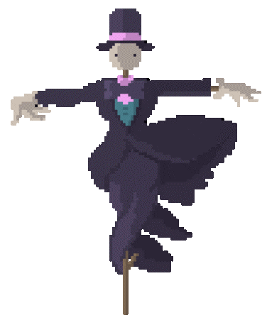

<!--
**Rafiiathallah/RafiiAthallah** is a ✨ _special_ ✨ repository because its `README.md` (this file) appears on your GitHub profile.

Here are some ideas to get you started:

- 🔭 I’m currently working on ...
- 🌱 I’m currently learning ...
- 👯 I’m looking to collaborate on ...
- 🤔 I’m looking for help with ...
- 💬 Ask me about ...
- 📫 How to reach me: ...
- 😄 Pronouns: ...
- ⚡ Fun fact: ...
-->

<!-- About me section -->

    <h1 align="left">Rafii Athallah 🐋</h1>

**`Computer Science Graduate | Full Stack Developer`**

<!-- Banner image -->

<h3>Hi there 👋 Welcome to my GitHub Page!</h3> 
My name is Rafii 🤝. I am currently learning and working on projects to sharpen my skills 💻. When I am not developing, I love to game, read comics, and do photography, all while enjoying a nice cup of coffee ☕️.
Feel free to explore my page!

<!-- Break added before Socials section -->
 

<!-- Socials section -->

<h2 align="left">🌐 Socials</h2>
<!-- Socials icons -->

    
   

<!-- Break added before Tech Stack section -->
 

<!-- Tech Stack Section -->

<h2 align="left">💻 Tech Stack</h2>
<!-- Tech Stack icons -->

    
                 

<!-- Break added before GitHub Stats section -->
 

<!-- GitHub Stats section -->

<h2 align="left">📊 GitHub Stats</h2>
<!-- GitHub stats -->

 
 

<!-- Break added before ending -->
 

---

<!-- Proudly created with GPRM ( https://gprm.itsvg.in ) -->

